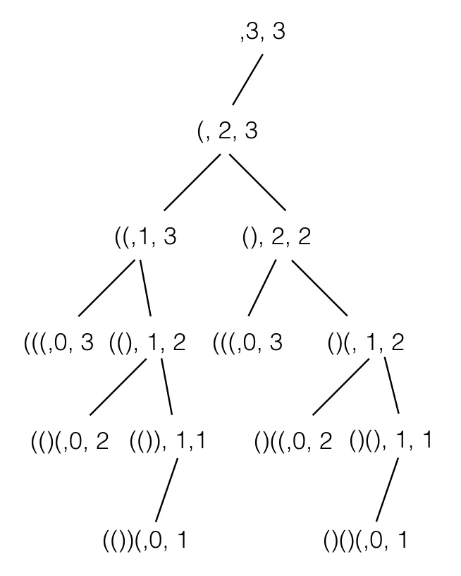

# 22. Generate Parentheses

## Intro

Given *n* pairs of parentheses, write a function to generate all combinations of well-formed parentheses.

For example, given *n* = 3, a solution set is:

```
[
  "((()))",
  "(()())",
  "(())()",
  "()(())",
  "()()()"
]
```

## Thinking

就是求括号的有效组合。一开始我的想法是将左括号代表0，右括号代表1，构建二进制数来寻找规律。发现了个简单的规律，然而并不足以解题。比如n=3， 那么低三位的情况分为有三个1和有两个1，其中有两个1的有效情况是5和3(二进制下)。当n为4，发现低4位有效的情况，也都是奇数。然而后没继续的下去。通过查看资料，大部分的方法都是递归。

假设n=3，可以画出递归树。




## Solution

Python

```python
class Solution(object):
    def generateParenthesis(self, n):
        """
        :type n: int
        :rtype: List[str]
        """
        ret = []
        def gen(p, left, right):
            if left:
                gen(p+'(', left-1, right)
            if right > left:
                gen(p+')', left, right-1)
            if not right:
                ret.append(p)
            return ret
        return gen('', n, n)
```