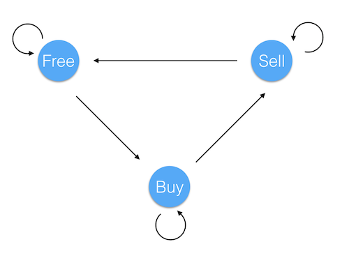

# 309. Best Time to Buy and Sell Stock with Cooldown

## Intro

Say you have an array for which the ith element is the price of a given stock on day i.

Design an algorithm to find the maximum profit. You may complete as many transactions as you like (ie, buy one and sell one share of the stock multiple times) with the following restrictions:

* You may not engage in multiple transactions at the same time (ie, you must sell the stock before you buy again).
* After you sell your stock, you cannot buy stock on next day. (ie, cooldown 1 day)

#### Example

```
prices = [1, 2, 3, 0, 2]
maxProfit = 3
transactions = [buy, sell, cooldown, buy, sell]
```

## Thinking

思考了一段时间，感觉是dp，但是没想到这个是多个状态的转移。



Free代表没买，Buy代表买入股票以后，Sell代表卖出以后。这三种状态得转移如图所示。Free的产生是由上一次的Free的状态和Sell的状态比较大小得来，Buy是由上一次Buy和Free减当前股票价格比大小得来，Sell是由上一次Buy加上当前股票价格得来。最后的利润结果其实就是比较最后时Free和Sell的大小。


## Solution

Python

```python
class Solution(object):
    def maxProfit(self, prices):
        """
        :type prices: List[int]
        :rtype: int
        """
        if not prices:
            return 0
        free = 0
        buy = 0 - prices[0]
        sell = float('-inf')
        for p in prices:
            free, buy, sell = max(free, sell), max(buy, free - p), buy + p
        return max(free, sell)
```